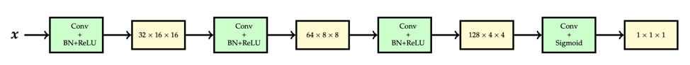
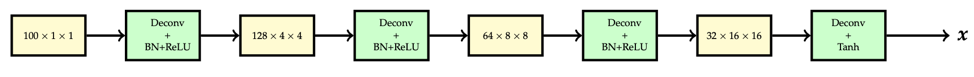

1.A Multi-layer Percetron for Natural Language Processing 
===============
1.1 Overview
-------
This project will train a multi-layered perceptron for natural language processing. The task is to predict the next word in a sentence given a sequence of words. 

1.2 Network Architecture
-------
This project will train a neural language model using a multi-layered perceptron like figure 1. It receives 3 consecutive words as the input and aims to predict a distribution over the next word. The model is trained by using the cross-entropy criterion, which is equivalent to maximizing the probability it assigns to the target words in the training set. 

     
      Fig.1 Model Architecture

1.3 Result Analysis
------
Creates a 2-D plot of the distributed representation space using an algorithm called t-SNE. Nearby points in the 2-D space are meant to correspond to nearby points in the 16-D word embedding space. From the learned model, we can create pictures of 2D visualization like figure 2. The common of these words in clusters is that they have similar words property and similar usage. For instance, the word cluster of ‘would, should, could, can, will, may, might’ is all modal verbs, and the word cluster of ‘my, your, our, their, his’ is all possessive adjectives.

     
      Fig.2 2D Visualization

By using the model to predict the next word, the result is:
- Input: ‘government of united’. Output: ‘state’ has the highest probability(0.47774) to be the next word.
- Input: ‘city of new’. Output: ‘york’ has the highest probability(0.98458) to be the next word.
- Input: ‘life in the’. Output: ‘world’ has the highest probability(0.18037) to be the next word.
- Input: ‘they could make’. Output: ‘it’ has the highest probability(0.59879) to be the next word.
- Input: ‘we do nt ’. Output: ‘know’ has the highest probability(0.24101) to be the next word.

2.Image Coloraztion 
===============
2.1 Overview
-------
The task is to train a convolutional neural network known as image colorization. That is, given a gray scale image, we wish to predict the color at each pixel. This a difficult problem for many reasons, one of which being that it is ill-posed: for a single gray scale image, there can be multiple, equally valid colorings. Here, we use three methods to predicte color and we can see that Unet is the best one and regression is the worst one.

2.2 Colorization as Regression
--------
A simple approach is to frame it as a regression problem, where we build a model to predict the RGB intensities at each pixel given the gray scale input. In this case, the outputs are continuous, and so squared error can be used to train the model. The validation output of the color regression is as figure 3.

     
      Fig.3 Validation Output of the Color Regression

2.3 Colorization as Classification
--------
We will select a subset of 24 colors and frame colorization as a pixel-wise classification problem, where we label each pixel with one of 24 colors. The 24 colors are selected using k-means clusteringa over colors, and selecting cluster centers.The validation output of the color classification is as figure 4.

     
      Fig.4 Validation Output of the Color Classification

2.4 Colorization Using Skip Connection
--------
A skip connection in a neural network is a connection which skips one or more layer and connects to a later layer. Add a skip connection from the first layer to the last, second kater to the second last, etc. That is, the final convolution should have both the output of the previous layer and the initial gray scale input as input. A common type of skip-connection is introduced by Unet.  The validation output of the colorization using Unet is as figure 5.

     
      Fig.5 Validation Output of the Colorization Using Unet

3.Words Translation from English to Pig-Latin 
===============
3.1 Overview
----------
The task is to train an attention-based neural machine translation (NMT) model to translate words from English to Pig-Latin. 
Pig Latin: It is a simple transformation of English based on the following rules (applied on a per-word basis):
1. If the first letter of a word is a consonant, then the letter is moved to the end of the word, and the letters “ay” are added to the end. For instance, team → eamtay.
2. If the first letter is a vowel, then the word is left unchanged and the letters “way” are added to the end: impress → impressway.
3. In addition, some consonant pairs, such as “sh”, are treated as a block and are moved to the end of the string together: shopping → oppingshay.

To translate a whole sentence from English to Pig-Latin, we simply apply these rules to each word indepen- dently: i went shopping → iway entway oppingshay.

Since the translation to Pig Latin involves moving characters around in a string, we will use character-level recurrent neural networks for our model. Since English and Pig-Latin are structurally very similar, the translation task is almost a copy task; the model must remember each character in the input, and recall the characters in a specific order to produce the output.

3.2 Encoder-Decoder Model
----------
A common architecture used for seq-to-seq problems is the encoder-decoder model, composed of two RNNs, as figure 6. The encoder RNN compresses the input sequence into a fixed-length vector, represented by the final hidden state. The decoder RNN conditions on this vector to produce the translation, character by character. The model is trained via a cross-entropy loss between the decoder distribution and ground-truth at each time step.

     
      Fig.6 Encoder-Decoder Model

The result of this model is as figure 7.

     
      Fig.7 Result of Encoder-Decoder Model

3.3 Teacher Forcing
----------
A common practice used to train NMT models is to feed in the ground-truth token from the previous time step to condition the decoder output in the current step. At test time, we don’t have access to the ground-truth output sequence, so the decoder must condition its output on the token it generated in the previous time step, as shown  in figure 8.

     
      Fig.8 Teacher Forcing Model

3.4 Gated Recurrent Unit (GRU) 
----------
Throughout the rest of the assignment, you will implement an attention-based neural machine translation model, and finally train the model and examine the results. The forward pass of a Gated Recurrent Unit is defined by the following equations:

     
      GRU Equation

3.5 Implementing and Visualizing Attention 
----------

Attention allows a model to look back over the input sequence, and focus on relevant input tokens when producing the corresponding output tokens. For this task, attention can help the model remember tokens from the input, e.g., focusing on the input letter c to produce the output letter c.

One of the benefits of using attention is that it allows us to gain insight into the inner workings of the model. By visualizing the attention weights generated for the input tokens in each decoder step, we can see where the model focuses while producing each output token. In this part of the assignment, you will visualize the attention learned by your model, and try to find interesting success and failure modes that illustrate its behavior.

     
      Fig.9 Successful Word Pairs

     
      Fig.10 Failed Word Pairs

     
      Fig.11 Successful Attention Map

     
      Fig.12 Failed Attention Map

4.DCGAN and CycleGAN
================
4.1 Overview
-------
This task consists of two parts: in the first part, we will implement a specific type of GAN designed to process images, called a Deep Convolutional GAN (DCGAN). We will train the DCGAN to generate emojis from samples of random noise. In the second part, we will implement a more complex GAN archi- tecture called CycleGAN, which was designed for the task of image-to-image translation. We will train the CycleGAN to convert between Apple-style and Windows-style emojis.

4.2 Deep Convolutional GAN (DCGAN)
-------
A DCGAN is simply a GAN that uses a convolutional neural network as the discriminator, and a network composed of transposed convolutions as the generator. To implement the DCGAN, we need to specify three things: 1) the generator, 2) the discriminator, and 3) the training procedure.

The DCGAN discriminator is a convolutional neural network that has the following architecture:

     
      Fig.13 Discriminator Architecture for DCGAN

The generator of the DCGAN, which consists of a sequence of transpose convolu- tional layers that progressively up sample the input noise sample to generate a fake image. The generator we will use in this DCGAN has the following architecture:

     
      Fig.14 Generator Architecture for DCGAN

     
       

     
       Fig.15 Images Generated by DCGAN Model in iteration 400, 2000 and 5600

We can see that the image of iteration 400 is very blurry and it is hard for us to identify. The boundary between the objectives and background is not clear. During the training, the quality of images becomes better and better. The images are more clear and we could identify some objectives. At the end of the iteration, the model could get a relatively good result.

4.2 CycleGAN
-------
A recently-introduced method for image-to-image translation, called CycleGAN, is particularly inter- esting because it allows us to use un-paired training data. This means that in order to train it to translate images from domain X to domain Y , we do not need exact correspondences between individual images in those domains. For example, in the paper that introduced CycleGANs, the authors are able to translate between images of horses and zebras, even though there are no images of a zebra in exactly the same position as a horse, and with exactly the same background, etc.

Thus, CycleGANs enable learning a mapping from one domain X (say, images of horses) to another domain Y (images of zebras) without having to find perfectly matched training pairs. 

Now we will build a CycleGAN and use it to translate emojis between two different styles, in particular, Windows ⇔ Apple emojis.

     
       Fig.16 CycleGAN architecture includes two generators GX→Y, GY→X and a discriminator DY

The generator in CycleGAN has layers that implement three stages of computation: 1) the first stage encodes the input via a series of convolutional layers that extract the image features; 2) the second stage then transforms the features by passing them through one or more residual blocks; and 3) the third stage decodes the transformed features using a series of transpose convolutional layers, to build an output image of the same size as the input.

     
       Fig.17 Generator Architecture GX→Y for CycleGAN

     
       

     
       Fig.18 Output Images of CycleGAN without the cycle-consistency loss in iteration 600

     
       Fig.19 Output Images of CycleGAN with the cycle-consistency loss in iteration 600

     
       Fig.20 Output Images of pre-trained CycleGAN without the cycle-consistency loss in iteration 100

     
       Fig.21 Output Images of pre-trained CycleGAN without the cycle-consistency loss in iteration 100

we could see that the result with the cycle consistency loss is better than the result without the cycle consistency loss overall. The objectives are more clear in the result with the cycle consistency loss, and they are more similar with the original images in shape and small details compared with the result without cycle consistency loss.

